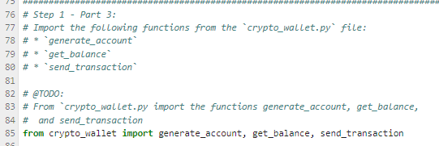
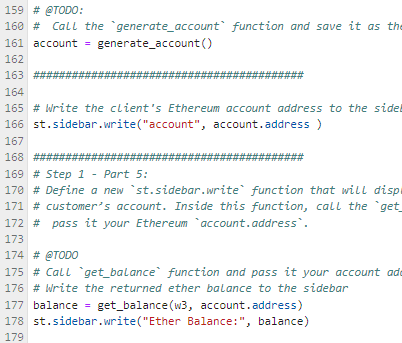
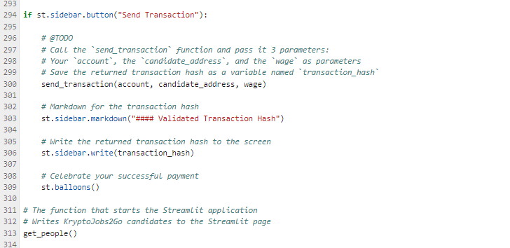
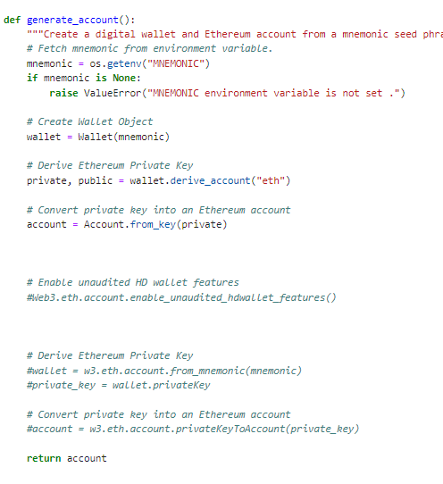
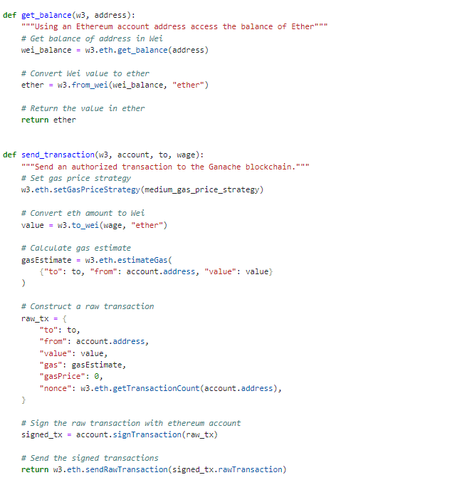
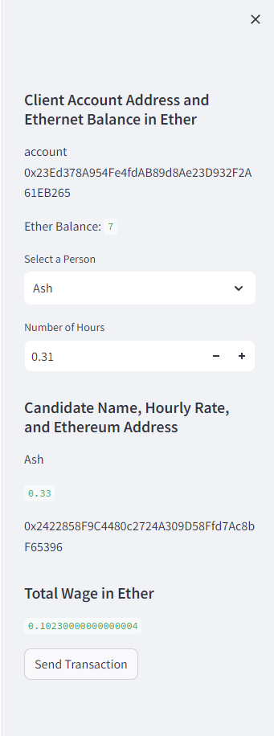
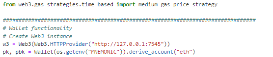
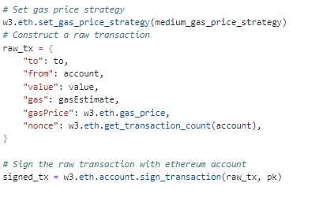
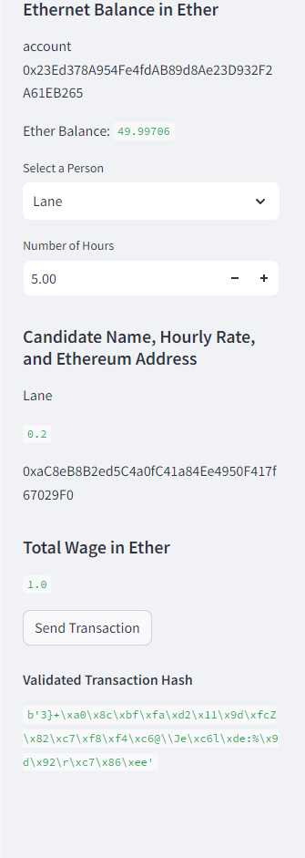
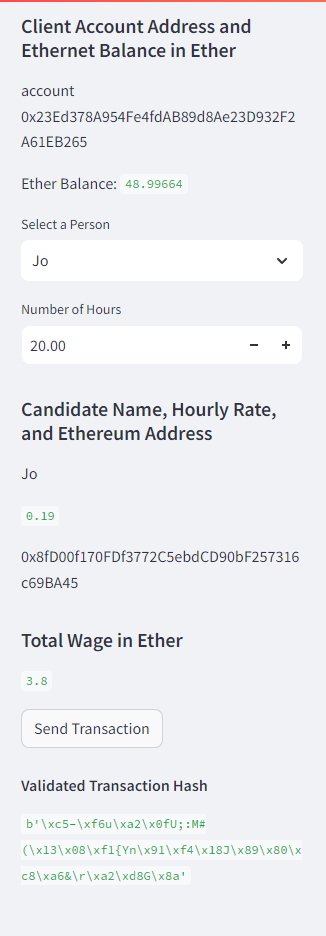

    
# Decentralized Hiring/ Freelance Platform
    
##### Created by [Demi Oyebanji](mailto:oluwademiladeoyebanji@outlook.com) as an assignment for the **UofT SCS Financial Technology Bootcamp**
________________________________________________________________________________________________________

**Imported Function From Crypto_Wallet**

**Created 'Generate Account' Function in Streamlit front-end**

**Created 'Wage' Calculators in Streamlit front-end**

**Created 'Send Transaction' Function in Streamlit front-end**

#### Kept recieving errors so had to make some further changes to the code

**Tested different methods of generating the private key but at the end the from_key method was the only thing that worked**

**Also had to change a lot of functions either from or to an older version. Things like changing ToWei to to_wei and so on**

### The generated front-end in Streamlit

### I was able to fill out the transaction information but I kept running into more errors

### To fix the errors, I had to store my private key as an additional variable from the environment. If I didn't do this the account key info would save as a string. 

### This alllowed me to insert the private key directly into the signature and sign the transactions. 

### Which allowed me to finally run the transaction and recieve the transaction hash

