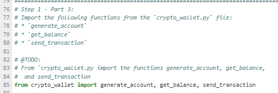
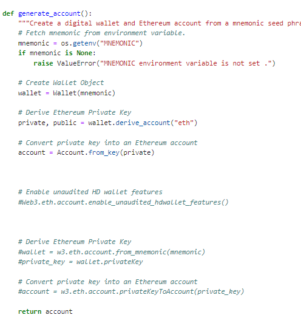
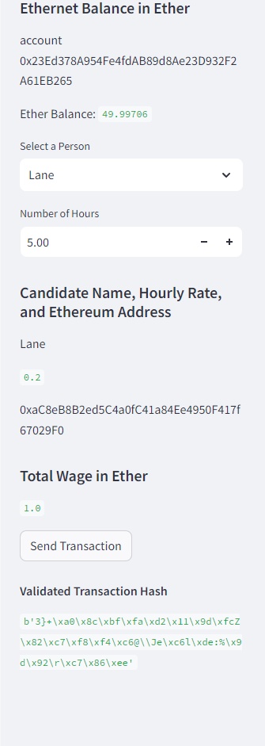
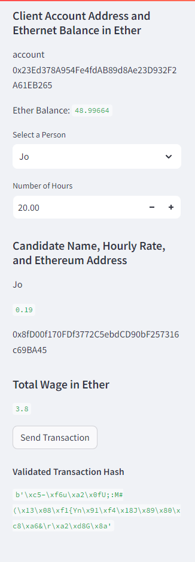

# Unit 19 Homework -Attempt 1

### I followed the steps till the very end but just couldn't get the streamlit application to run for the final screenshot

### I changed the generate_account function in multiple ways to try and get arround errors but my most popular errors were:

- AttributeError: type object 'Web3' has no attribute 'eth'
- ImportError: cannot import name 'generate_account' from 'crypto_wallet' 
- AttributeError: 'LocalAccount' object has no attribute 'privateKey'
- AttributeError: type object 'Account' has no attribute 'privateKeyToAccount'
- AttributeError: The use of the Mnemonic features of Account is disabled by default until its API stabilizes. To use these features, please enable them by running `Account.enable_unaudited_hdwallet_features()` and try again.

Also for some reason halfway through my environment file stopped loading in my mnemonic. I used the code 

if mnemonic is None:
        raise ValueError("MNEMONIC environment variable is not set .")
        
to troubleshoot as I tried different things. I also created a Phython notebook where I could test out different solutions. Eventually I  made a new folder and moved all files over to make it work. At which point I started getting the errors mentioned above. for the generate_account function. 

I have attached all my files but I couldn't find any solutions on 
[stackoverflow](https://stackoverflow.com/questions/71513953/python-web3-how-to-get-an-address-from-a-private-key), [github](https://github.com/ethereum/web3.py/issues/1889), [ehterumstack](https://ethereum.stackexchange.com/questions/117104/attributeerror-type-object-web3-has-no-attribute-eth), or [stackoverflow2](https://stackoverflow.com/questions/75834257/how-to-fix-attributeerror-web3-object-has-no-attribute-tochecksumaddress)

# Unit 19 Homework -Attempt 2

### Long story short after lots and lots of troubleshooting I was finally able to get it to work.

#### I started by making the appropriate changes to both files
**Imported Documents From Crypto_Walets**

**Created 'Generate Account' Function in Streamlit**

**Created 'Wage' Calculators in Streamlit**

**Created 'Send Transaction' Function in Streamlit**

#### Kept recieving errors so had to make some further changes to the code

**Tested different methods of generating the private key but at the end the from_key method was the only thing that worked**

**Also had to change a lot of functions either from or to an older version (still not sure which is which). Things like changing ToWei to to_wei and so on**

### The page finally ran

### I was able to fill out the transaction information but I kept running into more errors

### To fix the errors, I had to store my private key as an additional variable from the environment. If I didn't do this the account key info would save as a string. 

### This alllowed me to insert the private key directly into the signature and sign the transactions. 

### Which allowed me to finally run the transaction and recieve the transaction hash

